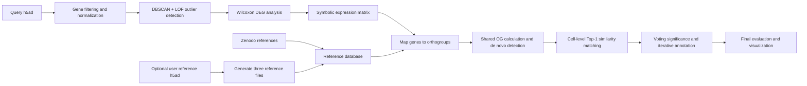

# CellBLASTer
A universal plant scRNA-seq annotation tool inspired by cellular BLAST strategies.
CellBlaster is a cross-species cell type identification and annotation tool designed specifically for plant single-cell transcriptome (scRNA-seq). Through cross-species orthogroups mapping, symbolic percentage encoding, and multi-round correction algorithms, it accurately maps the query dataset to the reference database, achieving high-confidence automatic cell type annotation.


# CellBLASTer currently supports:
- Dicot and Monocot / Root, Leaf, and Flower reference databases;
- User-provided custom reference `.h5ad` datasets;
- Detection of potential de novo cell types;
- Multi-round iterative annotation;
- CSV, PNG, and PDF outputs;
- A Python API, the `cellblaster` command, and `python -m CellBLASTer`.

# Analysis workflow


# Software requirements
Python >= 3.9
An isolated Conda or virtual environment is recommended. For recent Scanpy and AnnData releases, use a mutually compatible dependency set.

The package declares the following primary dependencies in `setup.py`:
```text
numpy >= 1.23
pandas >= 1.5
requests >= 2.28
matplotlib >= 3.6
seaborn >= 0.12
scipy >= 1.9
scikit-learn >= 1.2
numba >= 0.57
scanpy >= 1.9
```
Scanpy installs related dependencies such as AnnData and h5py.

### Recommended computing resources
- CPU: at least 1 cores; 20–30 or more cores are recommended for large references;
- Memory: at least 32 GB, depending on the numbers of cells and genes;
- Storage: sufficient space for downloaded databases, query intermediates, and round-specific results;
Some Scanpy and scikit-learn operations may densify sparse matrices, which can substantially increase memory use.

# Installation
### Install directly from GitHub
Replace `YOUR_USERNAME` with the actual GitHub account name:
```bash
python -m pip install git+https://github.com/YOUR_USERNAME/CellBLASTer.git
```
### Clone and install
```bash
git clone https://github.com/YOUR_USERNAME/CellBLASTer.git
cd CellBLASTer
python -m pip install .
```
### Build on an offline server
If the server cannot reach PyPI but setuptools, wheel, and packaging are already installed in the active environment, run:
```bash
python -m build --no-isolation
```
To build only a wheel:
```bash
python -m pip wheel . --no-deps --no-build-isolation --wheel-dir dist
```
### Verify the installation
```bash
python -c "import CellBLASTer; print(CellBLASTer.__version__)"
```
Expected output:
```text
1.0.0
```
Display command-line help:
```bash
cellblaster --help
```
or:
```bash
python -m CellBLASTer --help
```
Import names are case-sensitive on Linux. Use:
```python
import CellBLASTer
```

# Input requirements
### Query h5ad


## Python Example
Comment out your **h5ad** file using the CellBlaster software in your  Python program, as shown below. 
Sample code is in the "**tests**" directory.
```
import CellBLASTer

annotator = CellBLASTer.CellBlaster(
    database_type="Dicot",
    organ="Root",
    symbols=["SRP169576"],
    output_path="./Output",
    query="./SRP182008.h5ad",
    query_symbol="SRP182008",
    n_jobs=30,
)

results = annotator.Annotation()
```

The class can also be imported directly:

```python
from CellBLASTer import CellBlaster
```


## Command-line interface
After installation, all three commands below are supported:
```bash
cellblaster --help
python -m CellBLASTer --help
python CellBLASTer/CellBlaster.py --help
```
Example:
```bash
cellblaster \
    -t Dicot \
    -p Root \
    -s SRP169576 \
    -o ./Output \
    -q ./SRP182008.h5ad \
    -qs SRP182008 \
    --n-jobs 30
```

Optional user-defined reference dataset:
```bash
cellblaster \
    -t Dicot \
    -p Root \
    -s SRP169576 \
    -o ./Output \
    -q ./SRP182008.h5ad \
    -qs SRP182008 \
    --reference-adata ./MyReference.h5ad \
    --reference-symbol MyReference
```
Both the query h5ad and an optional reference h5ad must contain a `Celltype`
column in `adata.obs`. Cell and gene identifiers must be unique.


## Argument Reference
| Option | Required | Default | Description |
|---|---:|---|---|
| `-t`, `--database_type` | Yes | None | Reference clade; must be `Dicot` or `Monocot`. The legacy alias `--dabase_type` is also accepted. |
| `-p`, `--organ` | Yes | None | Organ database; must be `Root`, `Leaf`, or `Flower`. |
| `-s`, `--symbols` | Yes | None | One or more online reference dataset symbols separated by spaces. |
| `-o`, `--output_path` | No | `./CellBLASTer_output` | Output directory. |
| `-q`, `--query` | Yes | None | Path to the query `.h5ad` file. |
| `-qs`, `--query_symbol` | Yes | None | Query name and output prefix. It may contain letters, numbers, periods, underscores, and hyphens and must begin with a letter or number. |
| `-f`, `--filter_keywords` | No | Built-in ncRNA list | Case-insensitive gene-name substrings to remove. User values replace the default list. |
| `--sample-ratio` | No | No downsampling | Stratified reference downsampling ratio satisfying `0 < ratio < 1`. Sampling uses Dataset + Celltype strata and random seed 42. |
| `--n-jobs` | No | Up to 30 | Requested Numba threads for similarity calculation; the actual value is limited by available CPUs and the Numba thread limit. |
| `--reference-adata` | No | None | Optional user-defined reference `.h5ad`; must be supplied with `--reference-symbol`. |
| `--reference-symbol` | No | None | Name and output prefix for the user-defined reference. |

### Non-coding RNA filtering
When `-f` is omitted, the built-in list includes common ncRNA terms such as `lncRNA`, `lincRNA`, `ncRNA`, `miRNA`, `MIR`, `snoRNA`, `snRNA`, `tRNA`, `rRNA`, `siRNA`, `antisense`, and `circRNA`.
Custom keywords:
```bash
-f LNC MIR rRNA tRNA
```
To disable keyword filtering, place `-f` at the end of the command without values:
```bash
cellblaster [other options] -f
```

## Demo: command-line usage

After installing CellBLASTer, enter the demo directory:

```bash
cd demo
```

Run the included query and user-defined reference examples:

```bash
cellblaster \
    -t Dicot \
    -p Root \
    -s SRP422815_1 SRP422815_2 SRP145013 GSE229126 CRA008788 SRP309176 \
    -o ./Output \
    -q ./Query_SRP285040.h5ad \
    -qs SRP285040_Query \
    --reference-adata ./Reference_SRP285040.h5ad \
    --reference-symbol SRP285040 \
    --n-jobs 30
```

The `cellblaster` command may be replaced with:

```bash
python -m CellBLASTer
```

Demo files:

| File | Description |
|---|---|
| `demo/Query_SRP285040.h5ad` | Query example used for annotation. |
| `demo/Reference_SRP285040.h5ad` | User-defined reference example. |
| `demo/code.sh` | Command-line example. |
| `demo/demo.py` | Python API example. |


## Demo: Python API

```python
import CellBLASTer

cellblaster = CellBLASTer.CellBlaster(
    database_type="Dicot",
    organ="Root",
    symbols=[
        "SRP422815_1",
        "SRP422815_2",
        "SRP145013",
        "GSE229126",
        "CRA008788",
        "SRP309176",
    ],
    output_path="./Output",
    query="./Query_SRP285040.h5ad",
    query_symbol="SRP285040_Query",
    filter_keywords=CellBLASTer.DEFAULT_NONCODING_RNA_KEYWORDS,
    reference_adata="./Reference_SRP285040.h5ad",
    reference_symbol="SRP285040",
    n_jobs=30,
)

result = cellblaster.Annotation()
print(result)
```

The class can also be imported directly:

```python
from CellBLASTer import CellBlaster
```

Python keyword arguments must use underscores:

```python
reference_adata="./Reference_SRP285040.h5ad"
reference_symbol="SRP285040"
```

`reference-adata` and `reference-symbol` are command-line option names and are not valid Python keyword arguments.

If the constructor in your installed version defines `filter_keywords=None` and applies the built-in list when the value is `None`, `filter_keywords` can be omitted. To disable filtering explicitly, use:

```python
filter_keywords=[]
```


## Query preprocessing details

The current release performs these steps:

1. Filter gene names using `filter_keywords`.
2. Remove genes detected in fewer than five cells.
3. Normalize each cell to a total count of 10,000.
4. Apply `log1p`.
5. Select up to 2,000 highly variable genes.
6. Scale the data and run PCA.
7. Run DBSCAN and LOF separately within each `Celltype`.
8. Use DBSCAN parameters `eps=10` and `min_samples=10`.
9. Use LOF parameters `n_neighbors=20` and `contamination=0.05`.
10. Remove cells classified as outliers by DBSCAN or LOF.
11. Calculate DEGs with the Wilcoxon method.
12. Apply DEG filters `p < 0.05` and `log2FC >= 0.5`.
13. Retain up to 150 DEGs per `Celltype`.
14. Divide expression percentiles into 50 symbolic levels.
15. Write `.topDEGs.csv`, `.all.txt`, and `.Celltype.txt`.


## Annotation and de novo detection

CellBLASTer maps query and reference genes to the selected orthogroup database and calculates shared-orthogroup counts between every query and reference type.

The initial de novo threshold is calculated from the lower boxplot boundary of the maximum shared-OG distribution:

```text
max(1, Q1 - 1.5 × IQR)
```

The threshold is capped at 15. The current implementation also requires the maximum shared-OG count to be below 10 before a type is directly classified as potentially de novo in round 0.

Non-de novo types proceed to cell-level Top-1 reference matching. CellBLASTer performs iterative assignments using cell-type voting, similarity scores, the Top-1/Top-2 margin, Fisher's exact test, and Benjamini-Hochberg correction. Types that cannot yet be assigned reliably proceed to the next round.


## Output structure

The output directory has the following structure:

```text
Output/
├── 01.DataBase/
│   ├── <reference>.all.txt
│   ├── <reference>.Celltype.txt
│   ├── <reference>.topDEGs.csv
│   ├── <organ_clade>_Orthogroups.txt
│   └── <organ>_celltype.txt
├── 02.QueryData/
│   ├── <query_symbol>.all.txt
│   ├── <query_symbol>.Celltype.txt
│   └── <query_symbol>.topDEGs.csv
└── 03.Blast_Result/
    ├── round_0/
    │   ├── Shared_OMG_all_CType.csv
    │   ├── Assignment_significance_round_0.csv
    │   └── De_novo_similar_round_0.csv
    ├── round_1/
    │   ├── 01.All_cell_match_round_1.csv
    │   ├── 02.Top1-predicted_count_round_1.csv
    │   ├── 02.Top1-predicted_count_round_1.png
    │   ├── 03.Top1-predicted_percent_round_1.csv
    │   ├── 03.Top1-predicted_percent_round_1.png
    │   ├── 04.Shared_OG_round_1.csv
    │   ├── 04.Shared_OG_round_1.png
    │   ├── 05.Blast_similarity_round_1.csv
    │   ├── 05.Blast_similarity_round_1.png
    │   ├── Assignment_significance_round_1.csv
    │   ├── 06.Assigned_celltype_in_round_1.csv
    │   └── 06.Assigned_celltype_in_round_1.png
    ├── round_2/ ...
    └── final_visual/
        ├── Proportion_Top1-predicted.csv
        ├── Final_evaluation.csv
        ├── 1.Assigned_Ctype_bar.png
        ├── 1.Assigned_Ctype_bar.pdf
        ├── 2.Proportion_Top1-predicted.png
        ├── 2.Proportion_Top1-predicted.pdf
        ├── 3.Proportion_Top1-predicted_clustered.png
        ├── 3.Proportion_Top1-predicted_clustered.pdf
        ├── 4.C_OHAS_prediction_type.png
        └── 4.C_OHAS_prediction_type.pdf
```

Round-0 assignment files are created only when de novo types are detected. The final clustered heatmap is created only when the final proportion matrix contains at least two query types and two reference types.


## Main output files

| File | Description |
|---|---|
| `Shared_OMG_all_CType.csv` | Shared-orthogroup counts between query and reference cell types. |
| `01.All_cell_match_round_N.csv` | Best reference-cell match and distance/similarity result for every query cell in round N. |
| `02.Top1-predicted_count_round_N.csv` | Number of query cells assigned to each reference type by Top-1 matching. |
| `03.Top1-predicted_percent_round_N.csv` | Row-normalized Top-1 prediction percentages. |
| `04.Shared_OG_round_N.csv` | Shared-OG matrix aligned to the query and reference types present in the current round. |
| `05.Blast_similarity_round_N.csv` | Cell-type similarity matrix derived from shared OGs and Top-1 proportions. |
| `Assignment_significance_round_N.csv` | Assigned type, Top-1/Top-2 scores, margin, votes, P value, Q value, status, and round. |
| `06.Assigned_celltype_in_round_N.csv` | Query types resolved in the current round and their similarity scores. |
| `Final_evaluation.csv` | Final hierarchy matching, statistical evidence, voting evidence, margin evidence, and C-OHAS evaluation. |


## Visualizations

### 1. Assigned Cell Type bar plot

```text
final_visual/1.Assigned_Ctype_bar.png
final_visual/1.Assigned_Ctype_bar.pdf
```

Summarizes the final reference assignment proportions across query cell types.

### 2. Top-1 prediction proportion heatmap

```text
final_visual/2.Proportion_Top1-predicted.png
final_visual/2.Proportion_Top1-predicted.pdf
```

Displays the percentage of Top-1 matches from every query type to every reference type. A red border marks the maximum value in each row. This plot preserves the input order and does not cluster rows or columns.

### 3. Clustered prediction heatmap

```text
final_visual/3.Proportion_Top1-predicted_clustered.png
final_visual/3.Proportion_Top1-predicted_clustered.pdf
```

Clusters the final prediction-proportion matrix by rows and columns to reveal global similarity patterns between query and reference types.

### 4. C-OHAS prediction-type plot

```text
final_visual/4.C_OHAS_prediction_type.png
final_visual/4.C_OHAS_prediction_type.pdf
```

Displays the C-OHAS score and prediction type for each query cell type, providing a combined view of prediction category and evidence strength.

### 5. Round-specific Top-1 count heatmap

```text
round_N/02.Top1-predicted_count_round_N.png
```

Shows the number of query cells matched to each reference type in the current round.

### 6. Round-specific Top-1 percentage heatmap

```text
round_N/03.Top1-predicted_percent_round_N.png
```

Shows whether Top-1 matches are concentrated in particular reference types.

### 7. Shared-orthogroup heatmap

```text
round_N/04.Shared_OG_round_N.png
```

Displays shared-orthogroup counts between the query and reference types included in the current round.

### 8. BLAST similarity heatmap

```text
round_N/05.Blast_similarity_round_N.png
```

Displays the cell-type similarity score matrix for the current round.

### 9. Assigned cell-type heatmap

```text
round_N/06.Assigned_celltype_in_round_N.png
```

Displays query types resolved in the current round and their assigned reference types.

## Python return value

The Python API call:

```python
result = cellblaster.Annotation()
```

returns a dictionary with the principal output paths:

```python
{
    "database_dir": ".../01.DataBase",
    "query_dir": ".../02.QueryData",
    "result_dir": ".../03.Blast_Result",
    "evaluation": ".../03.Blast_Result/final_visual/Final_evaluation.csv",
}
```


# Other Information
## **Isoform Datasets Information**
| Species | Abbreviation | Classification | Root | Leaf | Flower |
|---------|--------------|----------------|------|------|--------|
| *Arabidopsis thaliana* | *A. thaliana* | Dicotyledon | √ | √ | √ |
| *Glycine max* | *G. max* | Dicotyledon | √ | √ | |
| *Manihot esculenta* | *M. esculenta* | Dicotyledon | √ | √ | |
| *Medicago truncatula* | *M. truncatula* | Dicotyledon | √ | | |
| *Lotus japonicus* | *L. japonicus* | Dicotyledon | √ | | |
| *Fragaria vesca* | *F. vesca* | Dicotyledon | | √ | |
| *Catharanthus roseus* | *C. roseus* | Dicotyledon | | √ | |
| *Gossypium bickii* | *G. bickii* | Dicotyledon | | √ | |
| *Brassica rapa* | *B. rapa* | Dicotyledon | | √ | |
| *Gossypium hirsutum* | *G. hirsutum* | Dicotyledon | | | √ |
| *Bombax ceiba* | *B. ceiba* | Dicotyledon | | | √ |
| *Nepeta tenuifolia* | *N. tenuifolia* | Dicotyledon | | √ | |
| *Oryza sativa* | *O. sativa* | Monocotyledon | √ | √ | √ |
| *Triticum aestivum* | *T. aestivum* | Monocotyledon | √ | | |
| *Zea mays* | *Z. mays* | Monocotyledon | √ | √ | √ |
| *Sorghum bicolor* | *S. bicolor* | Monocotyledon | √ | | |
| *Setaria viridis* | *S. viridis* | Monocotyledon | √ | | |
| *Phyllostachys edulis* | *P. edulis* | Monocotyledon | √ | | |

## **Root Datasets Information**
| Species | Classification | Accession |
|---------|----------------|-----------|
| *Arabidopsis thaliana* | Dicotyledon | SRP267870、SRP235541、SRP171040、SRP182008、SRP166333、SRP285817、SRP273996、SRP330542、SRP173393、SRP169576、SRP148288、SRP332285、SRP285040、SRP394711、SRP422815、SRP327656、SRP363581、SRP279055|
| *Glycine max* | Dicotyledon | CRA007122、CRA008947|
| *Manihot esculenta* | Dicotyledon | SRP406470 |
| *Medicago truncatula* | Dicotyledon | SRP390780 |
| *Lotus japonicus* | Dicotyledon | SRP376527 |
| *Oryza sativa* | Monocotyledon | SRP309176、SRP250946、CRA004082|
| *Triticum aestivum* | Monocotyledon | CRA008788、GSE270342、SRP543892|
| *Zea mays* | Monocotyledon | SRP145013、GSE225118、SRP335180|
| *Sorghum bicolor* | Monocotyledon | SRP422815_1 |
| *Setaria viridis* | Monocotyledon | SRP422815_2 |
| *Phyllostachys edulis* | Monocotyledon | GSE229126 |

## **Leaf Datasets Information**
| Species | Classification | Accession |
|---------|----------------|-----------|
| *Arabidopsis thaliana* | Dicotyledon | SRP292306、ERP132245、SRP247828_1、SRP247828_2、SRP247828_3、CRA002977_1、SRP307169、SRP280069、SRP398011、SRP338044、EMTAB11006|
| *Fragaria vesca* | Dicotyledon | CRA004848 |
| *Catharanthus roseus* | Dicotyledon | SRP335448 |
| *Gossypium bickii* | Dicotyledon | SRP424189 |
| *Glycine max* | Dicotyledon | CRA008947 |
| *Brassica rapa* | Dicotyledon | CRA006988 |
| *Nepeta tenuifolia* | Dicotyledon | SRP326816 |
| *Manihot esculenta* | Dicotyledon | CRA012723 |
| *Oryza sativa* | Monocotyledon | SRP286275、CRA004082|
| *Zea mays* | Monocotyledon | SRP281914、SRP325657、SRP224648、CRR923261、SRP417893|


## **Flower Datasets Information**
| Species | Classification | Accession |
|---------|----------------|-----------|
| *Arabidopsis thaliana* | Dicotyledon | SRP320285、EMTAB9174、SRP374045|
| *Gossypium hirsutum* | Dicotyledon | SRP241596、SRP379192|
| *Bombax ceiba* | Dicotyledon | CRA009614 |
| *Oryza sativa* | Monocotyledon | SRP386976 |
| *Zea mays* | Monocotyledon | SRP272727_23_26 |

### Contact Us
If you have any suggestions/ideas for CellBLASTer or are having issues trying to use it, please don't hesitate to reach out to us.
Lin Du,  3051095449@qq.com
